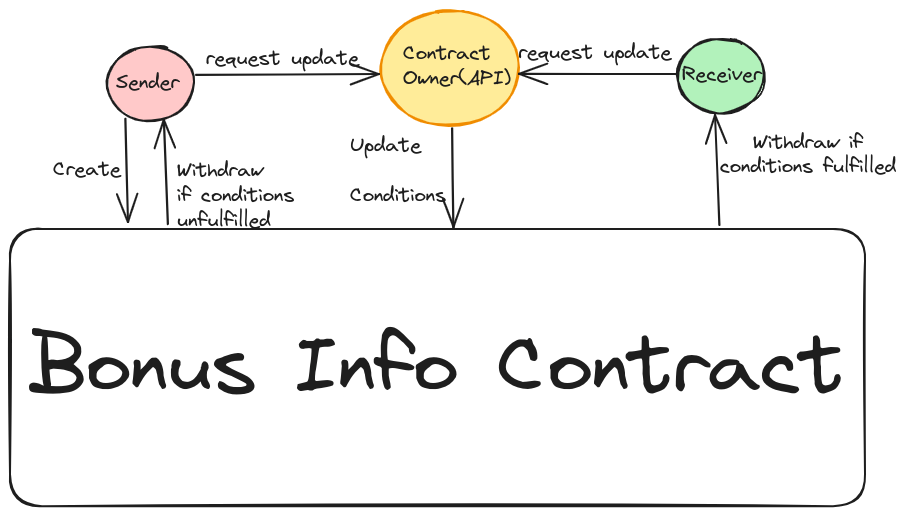

# Quickstart

Setup the .env file using the sample. You will need creator of the contract and property API key from rentcast.com.

This API backend must be called by the frontend.

```
npm install
```
```
npm start
```

# Architecture

The following figure shows how the API acts as an oracle to call the contract and make necessary updates to it.

